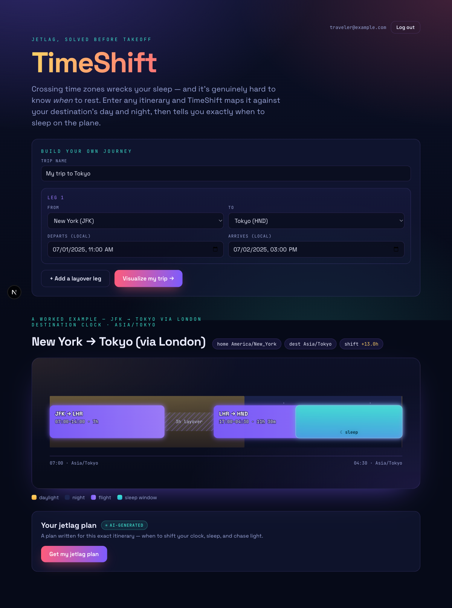
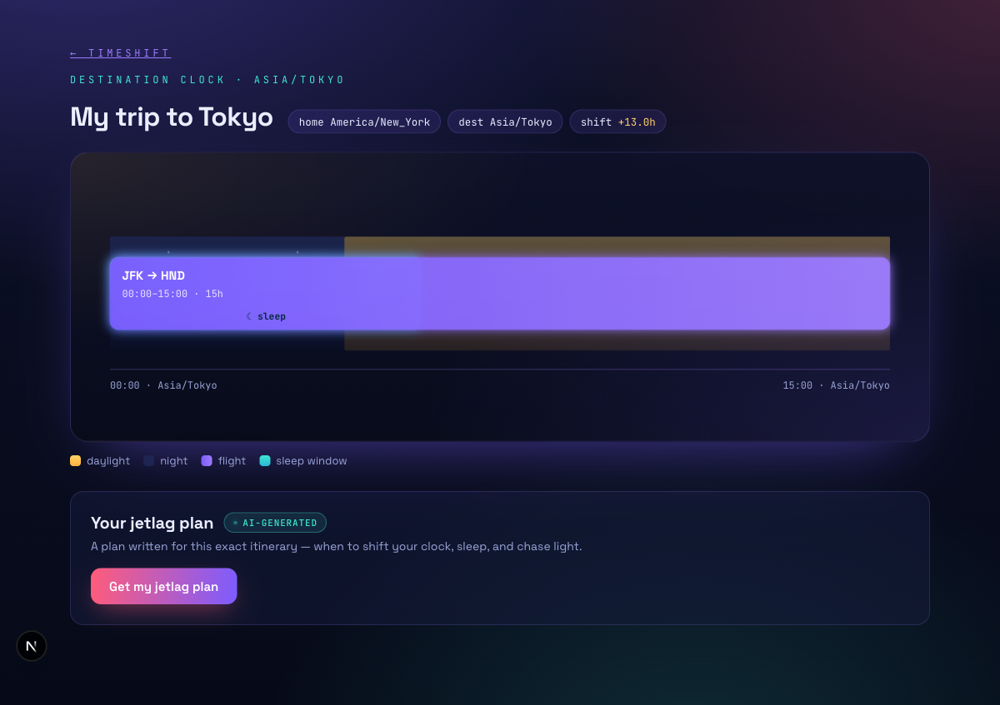

# TimeShift — Jetlag & Layover Visualizer

A high-performance itinerary visualization tool that helps international travelers
mitigate jetlag by mapping their biological clock against their destination's time
zone. Instead of a standard itinerary list, TimeShift renders a dynamic horizontal
timeline with color-coded day/night arcs at the destination, showing exactly when
to sleep on the plane.

**Sprint scope:** 5-day deployment · solo build · Test-Driven Development (Vitest)
throughout, with a documented Red → Green → Refactor cycle on the temporal engine.

---

## Stack

| Layer        | Choice                                            |
|--------------|---------------------------------------------------|
| Frontend     | Next.js (App Router), client-side visualization   |
| Backend      | Next.js API routes                                |
| Database     | PostgreSQL                                         |
| ORM          | Prisma (type-safe relational queries)             |
| Testing      | Vitest (TDD: Red-Green-Refactor)                  |
| Time/zones   | Luxon (IANA tz database) + SunCalc (sunrise/sunset)|

---

## Day 1 Deliverables (for review before build)

These are the specs due before any code is written. Each instructor requirement
maps to its own document:

| Instructor requirement              | Document                              |
|-------------------------------------|---------------------------------------|
| User Stories                        | [`docs/USER_STORIES.md`](docs/USER_STORIES.md) |
| Acceptance Criteria                 | [`docs/ACCEPTANCE_CRITERIA.md`](docs/ACCEPTANCE_CRITERIA.md) |
| Specifications                      | [`docs/SPECIFICATIONS.md`](docs/SPECIFICATIONS.md) |
| Prompts for writing Tests (TDD plan)| [`docs/TDD_PLAN.md`](docs/TDD_PLAN.md) |
| Context file (guardrails & rules)   | [`CLAUDE.md`](CLAUDE.md)              |

Build kickoff prompt for Claude Code: [`docs/KICKOFF_PROMPT.md`](docs/KICKOFF_PROMPT.md)

---

## Test Evidence (TDD)

> Populated during the sprint from real runs. Captures are numbered **per unit** in
> `docs/TDD_PLAN.md` order (`NN-name`), so the numbering tracks the units built rather
> than one entry per phase. Only links to committed files appear below; unbuilt phases
> are listed as pending.

### TDD cycle logs (Red → Green → Refactor)

Each unit's failing and passing runs are piped to `docs/logs/` and committed
alongside the code that produced them.

**Phase 0 — Harness**

- Sanity check — [`00-sanity-green.txt`](docs/logs/00-sanity-green.txt) (green only; trivial `1 + 1` harness proof)

**Phase 1 — UTC offsets & DST (US-E1)**

- Offsets (EST/EDT) — [`01-offsets-red.txt`](docs/logs/01-offsets-red.txt) → [`01-offsets-green.txt`](docs/logs/01-offsets-green.txt)
- Spring-forward gap — [`02-springforward-red.txt`](docs/logs/02-springforward-red.txt) → [`02-springforward-green.txt`](docs/logs/02-springforward-green.txt)
- Fall-back ambiguous hour — [`03-fallback-green.txt`](docs/logs/03-fallback-green.txt) (green only — see note)

> **No Red phase for the fall-back unit.** The first-occurrence resolution is inherited
> from Luxon (which resolves an ambiguous local time to the earlier instant), and `toUtc`
> already existed from the spring-forward unit — so this test characterizes
> existing-correct behavior rather than driving new code. No Red was fabricated; a single
> green run was captured.

**Phase 2 — Leap year (US-E2)**

- Duration across leap day — [`04-leapyear-red.txt`](docs/logs/04-leapyear-red.txt) → [`04-leapyear-green.txt`](docs/logs/04-leapyear-green.txt)
- Add-year clamping — [`05-addyear-red.txt`](docs/logs/05-addyear-red.txt) → [`05-addyear-green.txt`](docs/logs/05-addyear-green.txt)

**Phase 3 — International Date Line (US-E3)**

- West crossing (Tokyo → LA) — [`06-idl-tokyo-red.txt`](docs/logs/06-idl-tokyo-red.txt) → [`06-idl-green.txt`](docs/logs/06-idl-green.txt)
- Non-crossing guard (JFK → LHR) — [`06-idl-noncrossing-red.txt`](docs/logs/06-idl-noncrossing-red.txt) → [`06-idl-green.txt`](docs/logs/06-idl-green.txt)
- East crossing leap (LA → Sydney) — [`07-idl-sydney-red.txt`](docs/logs/07-idl-sydney-red.txt) → [`07-idl-sydney-green.txt`](docs/logs/07-idl-sydney-green.txt)

> **One Green for two unit-06 Reds.** The west-crossing and non-crossing tests were both
> driven Red first, then satisfied by a single precede-check implementation captured as
> `06-idl-green`. The LA → Sydney Red (`07`) then forced the eastward calendar-leap branch.

**Phase 4 — Day/night arcs (US-D2)**

- Sunrise/sunset tiling — [`08-arcs-red.txt`](docs/logs/08-arcs-red.txt) → [`08-arcs-green.txt`](docs/logs/08-arcs-green.txt)

**Phase 5 — Timeline assembly (US-D1/D3)**

- Segments + layover axis — [`09-timeline-red.txt`](docs/logs/09-timeline-red.txt) → [`09-timeline-green.txt`](docs/logs/09-timeline-green.txt)

**Phase 6 — Sleep windows (US-E4)**

- Red-eye in-air window — [`16-sleep-redeye-red.txt`](docs/logs/16-sleep-redeye-red.txt) → [`16-sleep-redeye-green.txt`](docs/logs/16-sleep-redeye-green.txt)
- Short daytime hop → zero windows — [`17-sleep-daytime-green.txt`](docs/logs/17-sleep-daytime-green.txt) (green only — see note)
- Never during a layover (covers in-air guard) — [`18-sleep-layover-green.txt`](docs/logs/18-sleep-layover-green.txt) (green only — see note)

> **Green-on-arrival for the daytime + layover cases.** The red-eye Red drove the general
> night-clipping implementation; the daytime-hop and layover cases were already handled
> correctly by it (zero windows when nothing overlaps destination night; layovers skipped
> as ground time), so they characterize existing behavior and close the branch-coverage
> gap rather than driving new code. No Red was fabricated.

**Timeline geometry (US-D1)**

- Scale helper (time → x) — [`20-scale-red.txt`](docs/logs/20-scale-red.txt) → [`20-scale-green.txt`](docs/logs/20-scale-green.txt)

**AI advice feature (US-F1)** — the deterministic glue, driven Red → Green against a **mocked** model client (no key required):

- Prompt carries the facts — [`10-ai-prompt-red.txt`](docs/logs/10-ai-prompt-red.txt) → [`10-ai-prompt-green.txt`](docs/logs/10-ai-prompt-green.txt)
- Prompt branch coverage — [`15-ai-prompt-branches-green.txt`](docs/logs/15-ai-prompt-branches-green.txt) (green only — pins westward/IDL/no-sleep branches)
- Well-formed response parses — [`11-ai-parse-ok-red.txt`](docs/logs/11-ai-parse-ok-red.txt) → [`11-ai-parse-ok-green.txt`](docs/logs/11-ai-parse-ok-green.txt)
- Malformed response fails safely — [`12-ai-parse-bad-red.txt`](docs/logs/12-ai-parse-bad-red.txt) → [`12-ai-parse-bad-green.txt`](docs/logs/12-ai-parse-bad-green.txt)
- Orchestration calls client + returns plan — [`13-ai-generate-ok-red.txt`](docs/logs/13-ai-generate-ok-red.txt) → [`13-ai-generate-ok-green.txt`](docs/logs/13-ai-generate-ok-green.txt)
- Orchestration degrades on client failure — [`14-ai-generate-fail-red.txt`](docs/logs/14-ai-generate-fail-red.txt) → [`14-ai-generate-fail-green.txt`](docs/logs/14-ai-generate-fail-green.txt)
- Engine → facts adapter — [`19-ai-facts-red.txt`](docs/logs/19-ai-facts-red.txt) → [`19-ai-facts-green.txt`](docs/logs/19-ai-facts-green.txt)

**Trip input (US-B1/C1)**

- Validate + UTC-normalize builder input — [`23-normalize-red.txt`](docs/logs/23-normalize-red.txt) → [`23-normalize-green.txt`](docs/logs/23-normalize-green.txt)

**Accounts (US-A1)**

- Validate credentials (email + 8-char password) — [`24-credentials-red.txt`](docs/logs/24-credentials-red.txt) → [`24-credentials-green.txt`](docs/logs/24-credentials-green.txt)

The auth/ownership wiring is integration, exercised by route tests (not unit-gated): register
hashes with **real bcrypt** and rejects duplicates; login is generic on failure; and the
**ownership-isolation** test proves a non-owner gets a bare 404 on another user's trip (US-B4).

**Sprint-end full run.** The complete passing suite and the 100%-coverage report are
captured from real runs: [`21-full-suite-green.txt`](docs/logs/21-full-suite-green.txt)
(48/48 passing) and [`22-coverage-green.txt`](docs/logs/22-coverage-green.txt)
(statements/branches/functions/lines all 100% across `lib/engine/` + `lib/ai/`, with
`lib/ai/client.ts` excluded as the live-network module).

### TDD cycle screenshots (colored Red → Green)

Each run above is also captured as a colored screenshot — produced from the same run as
its log via `npm run capture -- <NN-name-(red|green)> <vitest args>` (see
`scripts/capture-tdd.sh` + `scripts/render-tdd.mjs`). Red runs render failing tests and
assertion errors in red; green runs render the passing suite in green. Images share the
`NN-name` numbering of the logs:

- Sanity check — `docs/screenshots/00-sanity-green.png`
- Offsets (EST/EDT) — `docs/screenshots/01-offsets-red.png` → `docs/screenshots/01-offsets-green.png`
- Spring-forward gap — `docs/screenshots/02-springforward-red.png` → `docs/screenshots/02-springforward-green.png`
- Fall-back ambiguous hour — `docs/screenshots/03-fallback-green.png` (green only — see note above)
- Duration across leap day — `docs/screenshots/04-leapyear-red.png` → `docs/screenshots/04-leapyear-green.png`
- Add-year clamping — `docs/screenshots/05-addyear-red.png` → `docs/screenshots/05-addyear-green.png`
- West crossing (Tokyo → LA) — `docs/screenshots/06-idl-tokyo-red.png` → `docs/screenshots/06-idl-green.png`
- Non-crossing guard (JFK → LHR) — `docs/screenshots/06-idl-noncrossing-red.png` → `docs/screenshots/06-idl-green.png`
- East crossing leap (LA → Sydney) — `docs/screenshots/07-idl-sydney-red.png` → `docs/screenshots/07-idl-sydney-green.png`
- Sunrise/sunset tiling — `docs/screenshots/08-arcs-red.png` → `docs/screenshots/08-arcs-green.png`
- Segments + layover axis — `docs/screenshots/09-timeline-red.png` → `docs/screenshots/09-timeline-green.png`
- Red-eye sleep window — `docs/screenshots/16-sleep-redeye-red.png` → `docs/screenshots/16-sleep-redeye-green.png`
- Daytime hop / layover (green only) — `docs/screenshots/17-sleep-daytime-green.png`, `docs/screenshots/18-sleep-layover-green.png`
- Timeline scale helper — `docs/screenshots/20-scale-red.png` → `docs/screenshots/20-scale-green.png`
- AI prompt / parse / generate (US-F1) — `docs/screenshots/10-ai-prompt-*.png`, `11-ai-parse-ok-*.png`, `12-ai-parse-bad-*.png`, `13-ai-generate-ok-*.png`, `14-ai-generate-fail-*.png`, `15-ai-prompt-branches-green.png`
- Engine → facts adapter — `docs/screenshots/19-ai-facts-red.png` → `docs/screenshots/19-ai-facts-green.png`

### AI advice feature — what is mocked-and-tested vs live-and-demo-only

> The engine and the AI glue (prompt assembly, response parsing, orchestration)
> are unit-tested deterministically with a **mocked** model client; the suite runs
> with no API key. The **live model call** is exercised in the demo with a real
> key. Model output is non-deterministic by nature, so it is never snapshot-asserted.

`lib/ai/` is server-only (CLAUDE.md §13). `facts.ts`, `prompt.ts`, `parse.ts`, and
`advice.ts` are pure and held at 100% coverage — including the malformed-response and
client-error branches. `lib/ai/client.ts` is the single module that touches the network
(the Anthropic SDK); it is excluded from coverage with an explicit `/* v8 ignore file */`
pragma and is exercised only in the demo. The API key lives in `.env.local` (gitignored);
`.env.example` documents the variable name with no value. Tests and coverage pass with no
key present.

### Data layer

Four tables — `User 1→* Trip 1→* FlightSegment` plus `User 1→* Session` (for
auth) — defined in [`prisma/schema.prisma`](prisma/schema.prisma) and migrated into
PostgreSQL (`prisma/migrations/`). Accounts use bcrypt-hashed passwords and opaque
DB-backed session tokens in an httpOnly cookie; every trip query is scoped to its owner,
so a non-owner can't read or act on someone else's trip (US-B4). Every timestamp is stored in UTC with the original IANA timezone
string kept alongside it, so all offset/DST reasoning stays delegated to Luxon. Layovers
are **derived** (gaps between consecutive segments), not stored. The query that feeds the
whole engine pipeline is `getTripWithSegments` in [`lib/db/trips.ts`](lib/db/trips.ts): an
ownership-scoped `findFirst` with an ordered `include` on segments. Schema, migrations, and
the thin query layer are configuration/integration, not TDD'd — the engine remains the TDD
showcase.

### End-to-end verification

The running app, captured from `http://localhost:3000/` via a headless browser. The
landing pairs a trip builder with a fully-worked example:



Any itinerary works — there is no seeded-data limitation. Entering airports + local times
in the builder and submitting drives the real path (validate → UTC-normalize → persist →
ownership-scoped fetch → engine → render) and lands on a per-trip page:



The pages were asserted against the engine's headline numbers — trip name, computed clock
shift (`+13.0h`), destination axis labels, and the in-air sleep window over the
destination's night. The **"AI-generated" panel is present** and degrades cleanly without a
key; its live model call is demo-only (it needs `ANTHROPIC_API_KEY` in `.env.local`) and is
never snapshot-asserted. A committed Playwright regression spec that re-asserts these numbers
in CI is the remaining polish item.

---

## Local Development (build phase)

```bash
# 1. Install
npm install

# 2. Configure environment (DATABASE_URL etc.) — .env is gitignored
cp .env.example .env

# 3. Run migrations + seed one demo trip
npx prisma migrate dev
npm run seed

# 4. Run the test suite (TDD loop) — no API key required
npm run test            # watch mode
npm run test:run        # single run
npm run test:coverage   # with coverage report

# 5. (Optional) enable the live AI advice call for the demo
#    Add ANTHROPIC_API_KEY to .env.local (gitignored). The timeline renders
#    without it; only the "Get my jetlag plan" button needs a key.

# 6. Start the dev server
npm run dev
```
