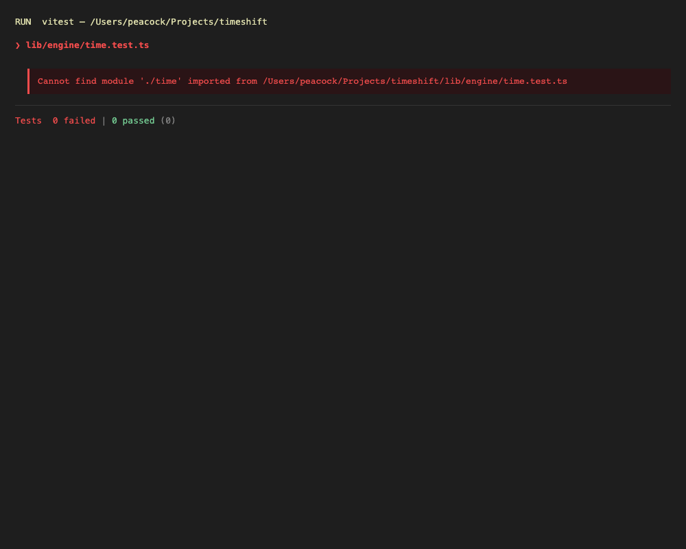
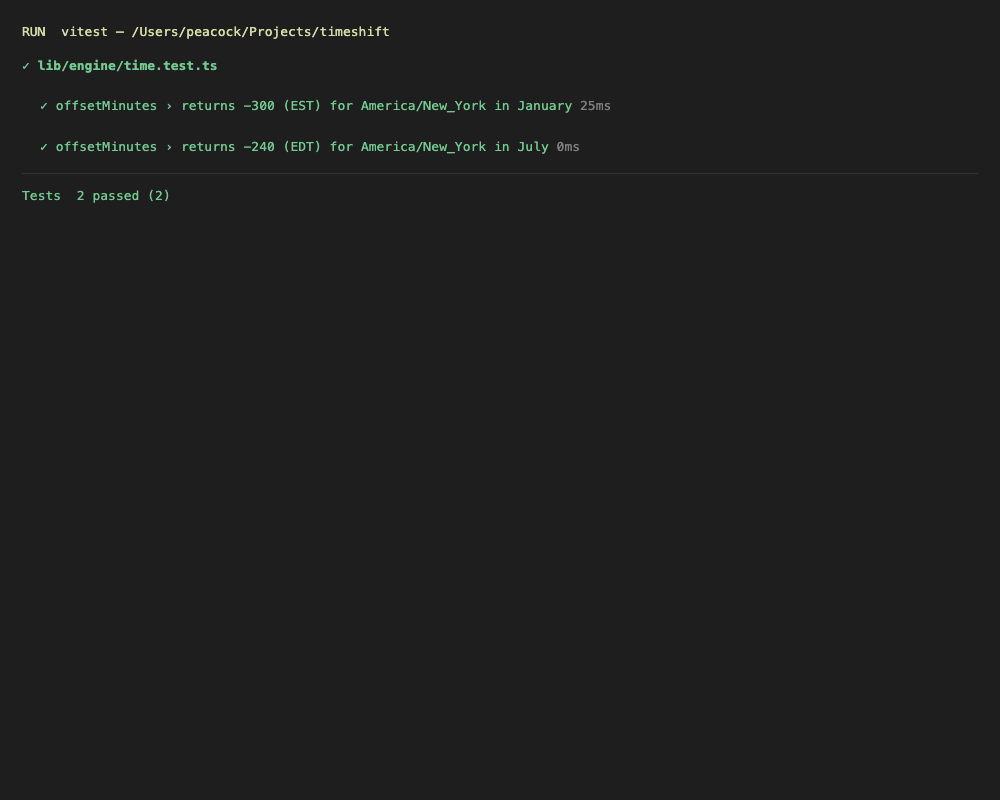

# TimeShift — Jetlag & Layover Visualizer

A high-performance itinerary visualization tool that helps international travelers
mitigate jetlag by mapping their biological clock against their destination's time
zone. Instead of a standard itinerary list, TimeShift renders a dynamic horizontal
timeline with color-coded day/night arcs at the destination, showing exactly when
to sleep on the plane.

**Sprint scope:** 5-day deployment · solo build · Test-Driven Development (Vitest)
throughout, with a documented Red → Green → Refactor cycle on the temporal engine.

---

## Stack

| Layer        | Choice                                            |
|--------------|---------------------------------------------------|
| Frontend     | Next.js (App Router), client-side visualization   |
| Backend      | Next.js API routes                                |
| Database     | PostgreSQL                                         |
| ORM          | Prisma (type-safe relational queries)             |
| Testing      | Vitest (TDD: Red-Green-Refactor)                  |
| Time/zones   | Luxon (IANA tz database) + SunCalc (sunrise/sunset)|

---

## Day 1 Deliverables (for review before build)

These are the specs due before any code is written. Each instructor requirement
maps to its own document:

| Instructor requirement              | Document                              |
|-------------------------------------|---------------------------------------|
| User Stories                        | [`docs/USER_STORIES.md`](docs/USER_STORIES.md) |
| Acceptance Criteria                 | [`docs/ACCEPTANCE_CRITERIA.md`](docs/ACCEPTANCE_CRITERIA.md) |
| Specifications                      | [`docs/SPECIFICATIONS.md`](docs/SPECIFICATIONS.md) |
| Prompts for writing Tests (TDD plan)| [`docs/TDD_PLAN.md`](docs/TDD_PLAN.md) |
| Context file (guardrails & rules)   | [`CLAUDE.md`](CLAUDE.md)              |

Build kickoff prompt for Claude Code: [`docs/KICKOFF_PROMPT.md`](docs/KICKOFF_PROMPT.md)

---

## Test Evidence (TDD)

> This section is populated during the sprint. Each screenshot below is captured
> from the local Vitest run at that phase of the Red-Green-Refactor cycle, so the
> README documents the actual test history of the temporal engine.

### Temporal engine — UTC offsets & DST

**Red (failing test written first)**
<!-- Capture the failing run and save it to the path below -->


**Green (minimal implementation passes)**


### Temporal engine — leap-year handling


### Temporal engine — International Date Line crossings


### Sleep-window recommendations


### Full suite + coverage


---

## Local Development (build phase)

```bash
# 1. Install
npm install

# 2. Configure environment (DATABASE_URL etc.) — .env is gitignored
cp .env.example .env

# 3. Run migrations
npx prisma migrate dev

# 4. Run the test suite (TDD loop)
npm run test            # watch mode
npm run test:run        # single run
npm run test:coverage   # with coverage report

# 5. Start the dev server
npm run dev
```
