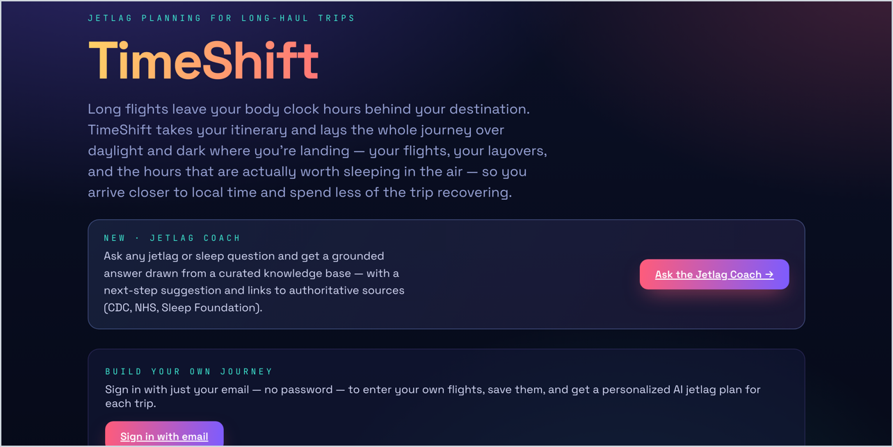
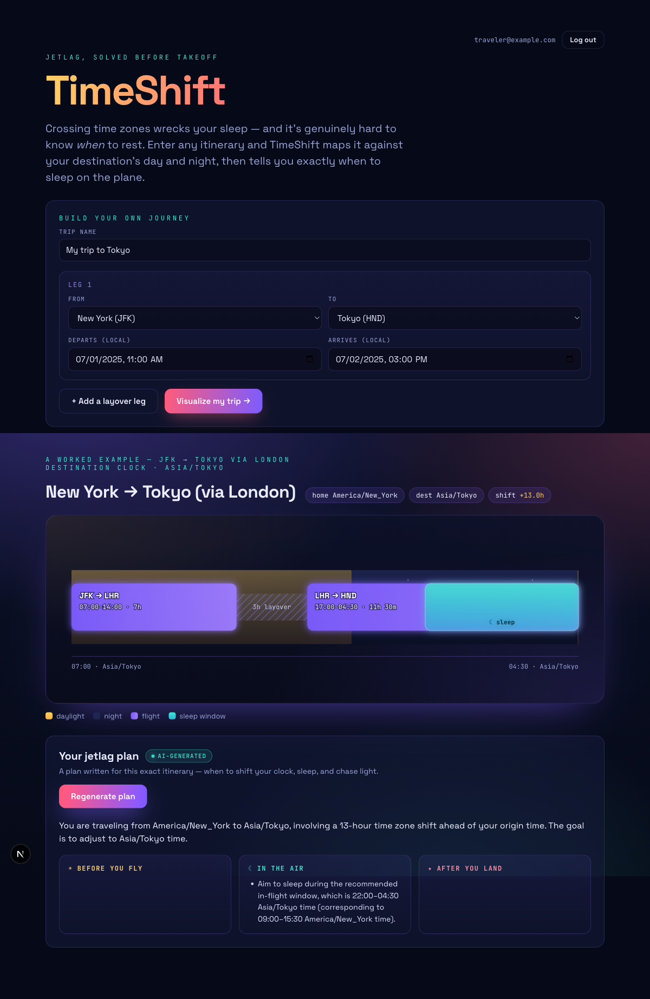
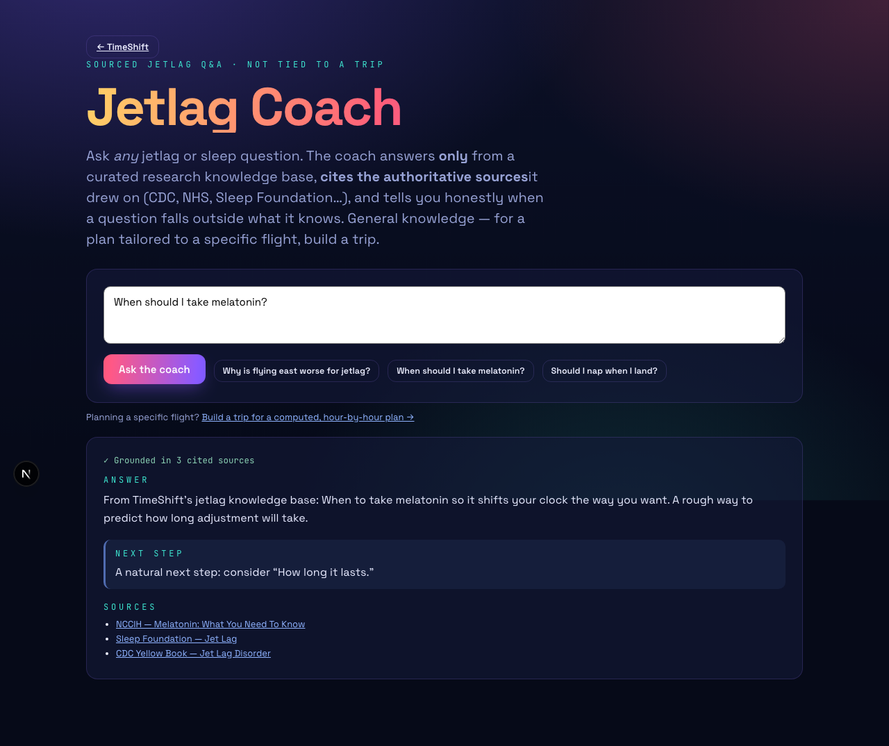
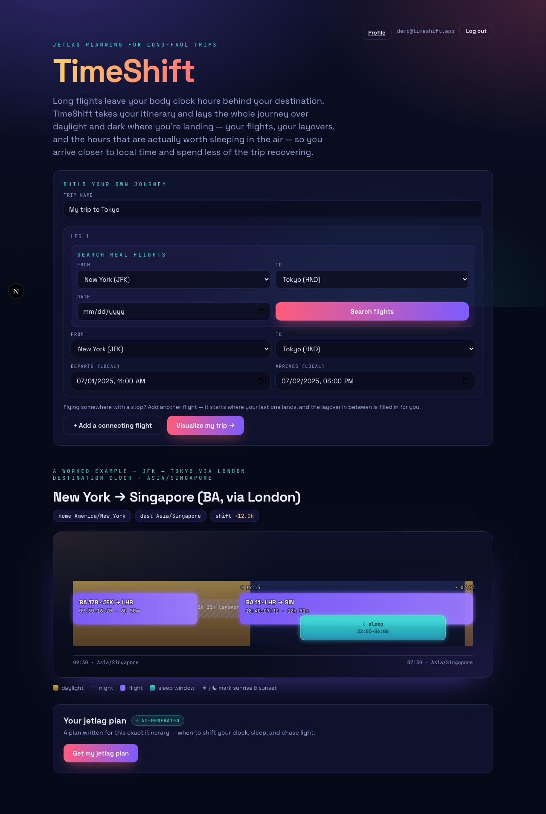
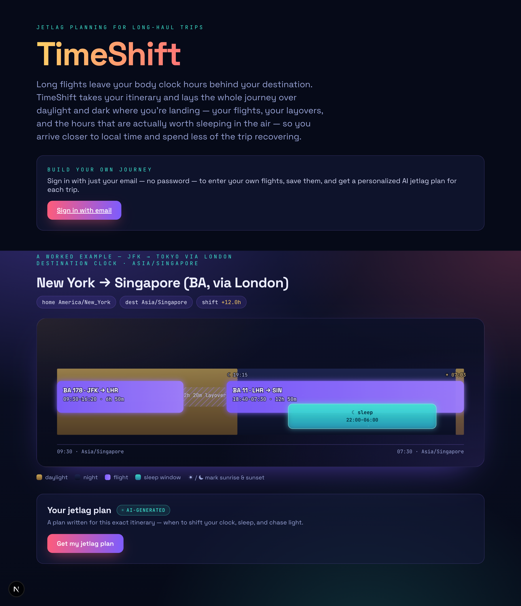
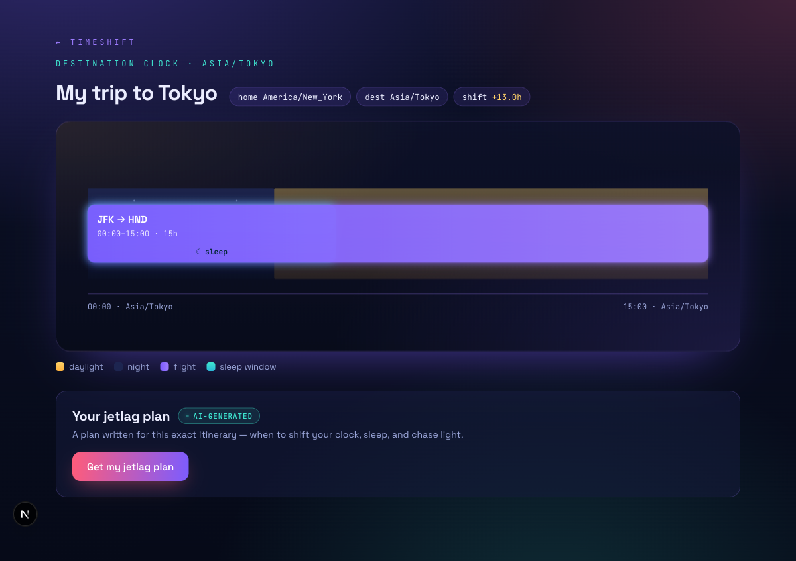

# TimeShift — Jetlag & Layover Visualizer

**▶ Live demo: [timeshift.windwardline.com](https://timeshift.windwardline.com)** — passwordless
magic-link sign-in (Resend), Postgres on Supabase, hosted on Vercel behind Cloudflare DNS.



A high-performance itinerary visualization tool that helps international travelers
mitigate jetlag by mapping their biological clock against their destination's time
zone. Instead of a standard itinerary list, TimeShift renders a dynamic horizontal
timeline with color-coded day/night arcs at the destination, showing exactly when
to sleep on the plane.

**Sprint scope:** 5-day deployment · solo build · Test-Driven Development (Vitest)
throughout, with a documented Red → Green → Refactor cycle on the temporal engine.

**Current state (August 2026):** CI runs typecheck, lint, the full Vitest suite,
and a production build on every push and pull request
([`.github/workflows/ci.yml`](.github/workflows/ci.yml)). The home page carries
two public showcase trips — NY → Singapore (`+12.0h`) and a LAX → Sydney
date-line crossing that surfaces `crossesDateLine` in the UI (US-E3). The
Jetlag Coach degrades to a grounded extractive answer when the live model call
fails (US-R). Playwright specs cover both showcases and the coach
(`npm run test:e2e`), and `npm run test:e2e:prod` smoke-tests the deployed site
itself for demo-morning checks.

---

## Stack

| Layer        | Choice                                            |
|--------------|---------------------------------------------------|
| Frontend     | Next.js (App Router), client-side visualization   |
| Backend      | Next.js API routes                                |
| Database     | PostgreSQL                                         |
| ORM          | Prisma (type-safe relational queries)             |
| Testing      | Vitest (TDD: Red-Green-Refactor)                  |
| Time/zones   | Luxon (IANA tz database) + SunCalc (sunrise/sunset)|

## Specs

The build was specified before it was written: user stories in
[`docs/USER_STORIES.md`](docs/USER_STORIES.md), acceptance criteria in
[`docs/ACCEPTANCE_CRITERIA.md`](docs/ACCEPTANCE_CRITERIA.md), technical
specifications in [`docs/SPECIFICATIONS.md`](docs/SPECIFICATIONS.md), the
test-writing plan in [`docs/TDD_PLAN.md`](docs/TDD_PLAN.md), and the operating
contract (guardrails, TDD law, AI boundary) in [`CLAUDE.md`](CLAUDE.md).

---

## Test Evidence (TDD)

> Captured from real runs during the sprint. Captures are numbered **per unit** in
> `docs/TDD_PLAN.md` order (`NN-name`), so the numbering tracks the units built rather
> than one entry per phase.

Each unit's failing and passing runs are piped to `docs/logs/` and committed
alongside the code that produced them. **Every log below also exists as a colored
screenshot** in `docs/screenshots/` under the same `NN-name` — red runs render the
failing assertions in red, green runs the passing suite in green, both produced
from the same run as the log via `npm run capture -- <NN-name-(red|green)> <vitest args>`
(`scripts/capture-tdd.sh` + `scripts/render-tdd.mjs`).

**Phase 0 — Harness**

- Sanity check — [`00-sanity-green.txt`](docs/logs/00-sanity-green.txt) (green only; trivial `1 + 1` harness proof)

**Phase 1 — UTC offsets & DST (US-E1)**

- Offsets (EST/EDT) — [`01-offsets-red.txt`](docs/logs/01-offsets-red.txt) → [`01-offsets-green.txt`](docs/logs/01-offsets-green.txt)
- Spring-forward gap — [`02-springforward-red.txt`](docs/logs/02-springforward-red.txt) → [`02-springforward-green.txt`](docs/logs/02-springforward-green.txt)
- Fall-back ambiguous hour — [`03-fallback-green.txt`](docs/logs/03-fallback-green.txt) (green only — see note)

> **No Red phase for the fall-back unit.** The first-occurrence resolution is inherited
> from Luxon (which resolves an ambiguous local time to the earlier instant), and `toUtc`
> already existed from the spring-forward unit — so this test characterizes
> existing-correct behavior rather than driving new code. No Red was fabricated; a single
> green run was captured.

**Phase 2 — Leap year (US-E2)**

- Duration across leap day — [`04-leapyear-red.txt`](docs/logs/04-leapyear-red.txt) → [`04-leapyear-green.txt`](docs/logs/04-leapyear-green.txt)
- Add-year clamping — [`05-addyear-red.txt`](docs/logs/05-addyear-red.txt) → [`05-addyear-green.txt`](docs/logs/05-addyear-green.txt)

**Phase 3 — International Date Line (US-E3)**

- West crossing (Tokyo → LA) — [`06-idl-tokyo-red.txt`](docs/logs/06-idl-tokyo-red.txt) → [`06-idl-green.txt`](docs/logs/06-idl-green.txt)
- Non-crossing guard (JFK → LHR) — [`06-idl-noncrossing-red.txt`](docs/logs/06-idl-noncrossing-red.txt) → [`06-idl-green.txt`](docs/logs/06-idl-green.txt)
- East crossing leap (LA → Sydney) — [`07-idl-sydney-red.txt`](docs/logs/07-idl-sydney-red.txt) → [`07-idl-sydney-green.txt`](docs/logs/07-idl-sydney-green.txt)

> **One Green for two unit-06 Reds.** The west-crossing and non-crossing tests were both
> driven Red first, then satisfied by a single precede-check implementation captured as
> `06-idl-green`. The LA → Sydney Red (`07`) then forced the eastward calendar-leap branch.

**Phase 4 — Day/night arcs (US-D2)**

- Sunrise/sunset tiling — [`08-arcs-red.txt`](docs/logs/08-arcs-red.txt) → [`08-arcs-green.txt`](docs/logs/08-arcs-green.txt)

**Phase 5 — Timeline assembly (US-D1/D3)**

- Segments + layover axis — [`09-timeline-red.txt`](docs/logs/09-timeline-red.txt) → [`09-timeline-green.txt`](docs/logs/09-timeline-green.txt)

**Phase 6 — Sleep windows (US-E4)**

- Red-eye in-air window — [`16-sleep-redeye-red.txt`](docs/logs/16-sleep-redeye-red.txt) → [`16-sleep-redeye-green.txt`](docs/logs/16-sleep-redeye-green.txt)
- Short daytime hop → zero windows — [`17-sleep-daytime-green.txt`](docs/logs/17-sleep-daytime-green.txt) (green only — see note)
- Never during a layover (covers in-air guard) — [`18-sleep-layover-green.txt`](docs/logs/18-sleep-layover-green.txt) (green only — see note)

> **Green-on-arrival for the daytime + layover cases.** The red-eye Red drove the general
> night-clipping implementation; the daytime-hop and layover cases were already handled
> correctly by it (zero windows when nothing overlaps destination night; layovers skipped
> as ground time), so they characterize existing behavior and close the branch-coverage
> gap rather than driving new code. No Red was fabricated.

**Timeline geometry (US-D1)**

- Scale helper (time → x) — [`20-scale-red.txt`](docs/logs/20-scale-red.txt) → [`20-scale-green.txt`](docs/logs/20-scale-green.txt)

**AI advice feature (US-F1)** — the deterministic glue, driven Red → Green against a **mocked** model client:

- Prompt carries the facts — [`10-ai-prompt-red.txt`](docs/logs/10-ai-prompt-red.txt) → [`10-ai-prompt-green.txt`](docs/logs/10-ai-prompt-green.txt)
- Prompt branch coverage — [`15-ai-prompt-branches-green.txt`](docs/logs/15-ai-prompt-branches-green.txt) (green only — pins westward/IDL/no-sleep branches)
- Well-formed response parses — [`11-ai-parse-ok-red.txt`](docs/logs/11-ai-parse-ok-red.txt) → [`11-ai-parse-ok-green.txt`](docs/logs/11-ai-parse-ok-green.txt)
- Malformed response fails safely — [`12-ai-parse-bad-red.txt`](docs/logs/12-ai-parse-bad-red.txt) → [`12-ai-parse-bad-green.txt`](docs/logs/12-ai-parse-bad-green.txt)
- Orchestration calls client + returns plan — [`13-ai-generate-ok-red.txt`](docs/logs/13-ai-generate-ok-red.txt) → [`13-ai-generate-ok-green.txt`](docs/logs/13-ai-generate-ok-green.txt)
- Orchestration degrades on client failure — [`14-ai-generate-fail-red.txt`](docs/logs/14-ai-generate-fail-red.txt) → [`14-ai-generate-fail-green.txt`](docs/logs/14-ai-generate-fail-green.txt)
- Engine → facts adapter — [`19-ai-facts-red.txt`](docs/logs/19-ai-facts-red.txt) → [`19-ai-facts-green.txt`](docs/logs/19-ai-facts-green.txt)

**Jetlag Coach — grounded RAG (US-R)** — pure retrieval/grounding + AI glue, driven Red → Green, keyless:

- Chunk markdown by heading — [`30-chunk-red.txt`](docs/logs/30-chunk-red.txt) → [`30-chunk-green.txt`](docs/logs/30-chunk-green.txt)
- Cosine vector search (top-k) — [`31-search-red.txt`](docs/logs/31-search-red.txt) → [`31-search-green.txt`](docs/logs/31-search-green.txt)
- Lexical fallback (TF-IDF cosine) — [`32-lexical-red.txt`](docs/logs/32-lexical-red.txt) → [`32-lexical-green.txt`](docs/logs/32-lexical-green.txt); bounded-score refactor [`32b-lexical-tfidf-red.txt`](docs/logs/32b-lexical-tfidf-red.txt) → [`32b-lexical-tfidf-green.txt`](docs/logs/32b-lexical-tfidf-green.txt)
- Refusal gate — [`33-ground-red.txt`](docs/logs/33-ground-red.txt) → [`33-ground-green.txt`](docs/logs/33-ground-green.txt)
- Grounded prompt assembly — [`34-grounded-prompt-red.txt`](docs/logs/34-grounded-prompt-red.txt) → [`34-grounded-prompt-green.txt`](docs/logs/34-grounded-prompt-green.txt)
- Grounded response parse (incl. malformed) — [`35-grounded-parse-red.txt`](docs/logs/35-grounded-parse-red.txt) → [`35-grounded-parse-green.txt`](docs/logs/35-grounded-parse-green.txt)
- Orchestrator (both paths + refusal + failure) — [`36-coach-red.txt`](docs/logs/36-coach-red.txt) → [`36-coach-green.txt`](docs/logs/36-coach-green.txt); no-vectors fallback [`36b-coach-novectors-red.txt`](docs/logs/36b-coach-novectors-red.txt) → [`36b-coach-novectors-green.txt`](docs/logs/36b-coach-novectors-green.txt)
- POST /api/coach route — [`37-coach-route-red.txt`](docs/logs/37-coach-route-red.txt) → [`37-coach-route-green.txt`](docs/logs/37-coach-route-green.txt)

**Trip input (US-B1/C1)**

- Validate + UTC-normalize builder input — [`23-normalize-red.txt`](docs/logs/23-normalize-red.txt) → [`23-normalize-green.txt`](docs/logs/23-normalize-green.txt)

**Accounts (US-A1)**

- Validate credentials (email + 8-char password) — [`24-credentials-red.txt`](docs/logs/24-credentials-red.txt) → [`24-credentials-green.txt`](docs/logs/24-credentials-green.txt)

The auth/ownership wiring is integration, exercised by route tests (not unit-gated): register
hashes with **real bcrypt** and rejects duplicates; login is generic on failure; and the
**ownership-isolation** test proves a non-owner gets a bare 404 on another user's trip (US-B4).

**Sprint-end full run.** The complete passing suite and the 100%-coverage report are
captured from real runs: [`21-full-suite-green.txt`](docs/logs/21-full-suite-green.txt)
(48/48 passing) and [`22-coverage-green.txt`](docs/logs/22-coverage-green.txt)
(statements/branches/functions/lines all 100% across `lib/engine/` + `lib/ai/`, with
`lib/ai/client.ts` excluded as the live-network module).

---

## The AI boundary — one rule, three features

Every AI-adjacent feature follows the same contract (CLAUDE.md §13): the
deterministic surface (prompt assembly, parsing, orchestration, retrieval,
validation) is pure, server-only, driven Red → Green against **mocked** clients,
and held at **100% coverage** including malformed-response and failure branches.
Exactly one module per feature touches the network; each is excluded from
coverage with an explicit `/* v8 ignore file */` pragma and exercised only in
the live demo. Keys live in `.env.local` (gitignored); `.env.example` documents
variable names with no values. **The suite and coverage pass with no key
present**, and live model output is never snapshot-asserted — it is
non-deterministic by nature.

### AI advice (US-F1) — live-verified

With a real `GEMINI_API_KEY` set, the per-trip panel makes a genuine Gemini call
(`gemini-3.1-flash-lite`, with a fastest-first fallback chain that drops to
lighter models on a rate limit) that narrates the engine's computed facts — the
screenshot quotes the 13-hour shift and the exact in-flight sleep window. The
network module is `lib/ai/client.ts`; without a key the timeline renders fully
and only the "Get my jetlag plan" button degrades.



### Jetlag Coach (US-R) — grounded RAG with verifiable citations

A standalone `/coach` page answers a free-form jetlag question **only** from
TimeShift's curated knowledge base: **55 hand-authored markdown docs** under
[`docs/kb/`](docs/kb/), chunked by `##` heading (~220 passages), each carrying
YAML frontmatter that names a real authoritative source. The coach cites **those
external links** (CDC, NHS, Sleep Foundation, …) — never an internal filename,
and never anything the model invented: citations derive from the *retrieved*
docs' metadata, so a fabricated source is impossible by construction. Every
answer includes a grounded **next-step follow-up**.

Retrieval is **semantic** (Google embeddings + cosine over precomputed vectors
in `docs/kb/kb-embeddings.json`) when a key and vectors are present, with a
**lexical TF-IDF-cosine fallback** so the feature works keyless — composing the
answer extractively; with a key it upgrades to an LLM-written answer, and the
**Sources are identical either way** since they come from retrieval, not the
model. A refusal gate (`decideAnswerable`) drops any question whose best passage
misses the threshold *before* any model call (AC-R2). The gate is
**path-aware** — embedding cosine and TF-IDF cosine sit on different scales, so
each path has its own env-overridable threshold (`COACH_THRESHOLD_SEMANTIC` ≈
0.62, `COACH_THRESHOLD_LEXICAL` ≈ 0.25); on the 55-doc KB the semantic path
separates cleanly (on-topic ≈0.75–0.82 vs off-topic ≈0.49–0.52), and the weaker
lexical path gates conservatively. Network/IO shells: `lib/rag/embed.ts` (query
embedding) and `lib/rag/corpus.ts` (filesystem KB load); regenerating vectors is
`npm run embed:kb` (`gemini-embedding-001`, 768 dims). The E2E runs keyless for
a deterministic grounded answer + refusal.



### Real flight selection — search, pick, and the leg fills itself

Rather than hand-typing airports and times, a traveler searches **real flights**
by route + date, gets a sortable list, and picks one — the leg fills with
accurate scheduled times, IANA zones, terminals, and coordinates, so layovers
compute from real gaps. The manual builder remains as a fallback. `lib/flights/`
(`validate.ts`, `parse.ts`, `sort.ts`, `status.ts`, `coords.ts`, `cache.ts`) is
the pure surface — including malformed-response, missing-field, IDL, and TTL
branches; `lib/flights/client.ts` is the network module (AviationStack). The
search route is session-gated, validates params before any upstream call, and
serves a **6-hour DB cache** (`FlightQueryCache`) to protect the free tier's
~100 req/month — keyless, the route returns a friendly error and the UI falls
back to manual entry. A leg departing within ~48h also shows a **live status
badge** (on-schedule / delayed / cancelled); trips planned weeks out have no
delay data yet, so future legs show scheduled-only by design. The free tier is
HTTP-only — a paid HTTPS plan is recommended for production.



---

## Data layer

Seven tables — `User 1→* Trip 1→* FlightSegment` plus `User 1→* Session` (for auth),
`LoginToken` (single-use magic-link tokens), and two standalone caches/counters:
`FlightQueryCache` (the flight-search TTL cache) and `RateLimit` (the fixed-window
counters below) — defined in
[`prisma/schema.prisma`](prisma/schema.prisma) and migrated into PostgreSQL
(`prisma/migrations/`). Sign-in is passwordless — a single-use magic-link token —
and sessions are opaque DB-backed tokens in an httpOnly cookie; every trip query is
scoped to its owner, so a non-owner can't read or act on someone else's trip (US-B4). Every timestamp is stored in UTC with the original IANA timezone
string kept alongside it, so all offset/DST reasoning stays delegated to Luxon. Layovers
are **derived** (gaps between consecutive segments), not stored. The query that feeds the
whole engine pipeline is `getTripWithSegments` in [`lib/db/trips.ts`](lib/db/trips.ts): an
ownership-scoped `findFirst` with an ordered `include` on segments. Schema, migrations, and
the thin query layer are configuration/integration, not TDD'd — the engine remains the TDD
showcase.

### The public-schema lockdown

Postgres is hosted on Supabase, and Supabase publishes every table in the `public`
schema through PostgREST — granting the `anon` role (the role behind a project's
publishable key) access to each new table Prisma creates. Prisma models neither
row-level security nor grants, so nothing in `schema.prisma` closes that door.
[`20260818204500_lock_down_public_schema`](prisma/migrations/20260818204500_lock_down_public_schema/migration.sql)
does, in two independent layers: RLS enabled on every table with no policies
(deny-all for every role but the owner the app connects as), and the PostgREST
grants revoked — including via `ALTER DEFAULT PRIVILEGES`, so a table added by a
later migration is not silently re-exposed. `FORCE ROW LEVEL SECURITY` is
deliberately not set; it would strip the owner's bypass and 500 every route.

[`security-rls.test.ts`](security-rls.test.ts) contract-tests this the way
`security-headers.test.ts` contract-tests the headers: a model added to
`schema.prisma` without its `ENABLE ROW LEVEL SECURITY` line fails CI.

### Rate limiting the open endpoints

Three endpoints take unauthenticated input and spend money on a third party:
`/api/coach` and the showcase branch of `/api/trips/[id]/advice` each cost a
Gemini call, and `/api/auth/request-link` sends mail through Resend to any
address supplied. All three are open deliberately — the coach and the showcase
trip are the demo, and sign-in cannot require a session — so the bound has to be
on rate rather than on identity.

[`lib/ratelimit/`](lib/ratelimit/) is a fixed-window counter: the window
arithmetic is pure and unit-tested, and the counter is a row in Postgres, because
Vercel is serverless and an in-memory count would be per-instance and reset on
every cold start. The increment is one `INSERT … ON CONFLICT DO UPDATE …
RETURNING`, so the returned count is the caller's own position in the window —
verified against a live database: 40 simultaneous requests against a limit of 5
admit exactly 5. Magic-link sends are limited per recipient as well as per
caller, since the inbox being filled belongs to someone other than the caller.
Subjects are hashed into the key rather than stored, so the counter table never
becomes a second list of email addresses — including addresses of people who
never signed up, since anyone can type one into the sign-in form. The limiter
only compares keys for equality, so a digest serves it identically.

That second limit is a genuine trade and is recorded as one: keying on the
supplied address stops a flood aimed at one inbox, but it also lets someone who
knows an address spend that address's allowance and delay its owner's sign-in for
the rest of the hour. The allowance sits well above normal use to keep that
expensive rather than free; `lib/ratelimit/config.ts` records the option for
removing the edge entirely, which changes sign-in behaviour and so is an owner
decision.

**It fails closed.** If the counter cannot be read, the request is refused rather
than allowed. A limiter that degrades to "unlimited" when the database is
unreachable hands an attacker the bypass — knock it over, then spend freely. The
refusal is logged with the likely cause, so it is never silent. The practical
consequence is a deployment-order requirement: **apply migrations before or with
the code that depends on them**, or these three endpoints will 429 until the
`RateLimit` table exists. The log says exactly that when it happens.

The migration only takes effect where it is applied, and production and preview
migrate separately by hand. `scripts/secure-database.sh` does the whole job for
one project — preflight checks, `migrate deploy`, verification, and rotating the
credentials the exposure made readable:

```bash
./scripts/secure-database.sh                 # prompts for the connection string
./scripts/secure-database.sh --verify-only   # read-only: report state, change nothing
```

Run with no arguments and it asks for the connection string (input hidden), echoes
back which project that string points at, and offers the second project when the
first finishes — so securing both is one invocation with nothing to fill in.

**Without a terminal:** [`docs/supabase-lockdown.sql`](docs/supabase-lockdown.sql)
is the same work as one script to paste into each project's Supabase SQL Editor —
no clone, no Node, no connection string. It applies the lockdown migrations, records
them in `_prisma_migrations` with the checksums `prisma migrate deploy` expects
(so the CLI stays consistent afterwards — checked end to end in
`docs/logs/99-paste-path-cli-consistency.txt`: a project fixed through the browser
alone leaves `prisma migrate status` reporting up to date and `deploy` a no-op),
rotates the exposed credentials, and
ends in **one** verification query whose every row must say `OK`. One query is
deliberate: the SQL Editor renders only the last statement's grid, so splitting
the verdict in two showed the operator half of it — a green lockdown once read as
a live exposure that way. The first row covers what exists now. The `future
objects` rows cover default privileges, one per (role, object class), and read
`OK` for Supabase's own internal role because a default-ACL entry only governs
objects created by its owner, never one your migrations make. **A grid of one row
saying `OK` is a pass**, not a truncated result — those rows are absent when
nothing grants at all. `supabase-lockdown-sql.test.ts` holds the single-statement
tail so it cannot silently split again.

The two paths differ in exactly one place, and the file says so where it matters:
`secure-database.sh` rotates only after verification passes and takes
`--skip-rotation`, while the paste file rotates inside the transaction, before the
verdict grid is read. That is what applying everything in one atomic paste costs,
and it fails in the safe direction — a transaction that aborts rotates nothing. To
defer rotation in the browser, delete the two `UPDATE` statements before clicking
Run; the SQL Editor is a scratch buffer, so that is not hand-editing the committed
file.

`pg_default_acl` holds a row per object class, so the revoke covers all of them —
`TABLES`, `SEQUENCES`, `FUNCTIONS`, `TYPES`. Functions need a second statement on
top of that: Postgres grants `EXECUTE` on every new function to `PUBLIC`, `anon`
is a member of `PUBLIC`, and that built-in default is recorded nowhere, so
revoking from `anon` by name leaves it standing. Measured before it was fixed — a
`SECURITY DEFINER` function in `public` (which runs as its owner, so RLS is no
help) returned a user's email address to `anon`, and both verifiers still said
`OK`. It is revoked **database-wide** by `20260819001500`, because the
schema-qualified spelling writes no row and changes nothing. Both tools now check
that revoke positively, since its failure state is an absent row rather than a
bad one.

Covering only tables and sequences was also an operational trap, not just a gap:
the verifier read the surviving functions row as a failure, and a failed
verification is what makes `secure-database.sh` skip credential rotation.
`security-rls.test.ts` asserts each class by name.

One transaction, and safe to run twice. It is generated from the migrations by
`node scripts/generate-supabase-sql.mjs`; `supabase-lockdown-sql.test.ts` fails CI
if the committed file drifts from them or is hand-edited.

It refuses the transaction pooler (port 6543, which cannot run migrations), names
which project the URL points at before touching it, and stops if the local Prisma
is not the pinned major. Re-running is safe.

## End-to-end verification

The running app, captured from `http://localhost:3000/` via a headless browser. The
landing pairs a trip builder with a fully-worked example:



Any itinerary works — there is no seeded-data limitation. Entering airports + local times
in the builder and submitting drives the real path (validate → UTC-normalize → persist →
ownership-scoped fetch → engine → render) and lands on a per-trip page:



The pages were asserted against the engine's headline numbers — trip name, computed clock
shift (`+12.0h` for the NY → Singapore showcase), destination axis labels, and the in-air
sleep window over the destination's night. These numbers are locked in by a committed
Playwright regression spec (`e2e/regression.spec.ts`, run with `npm run test:e2e`): it
seeds the showcase trip, opens the running app, and re-asserts the trip name, the `+12.0h`
clock shift, the home/destination zones, the flight legs, and the recommended sleep window —
so a temporal-engine regression fails the check rather than slipping through. It is a test,
not just a screenshotter (§8.B).

---

## Local Development

```bash
# 1. Install
npm install

# 2. Configure environment (DATABASE_URL etc.) — .env is gitignored
cp .env.example .env

# 3. Run migrations + seed one demo trip
npx prisma migrate dev
npm run seed

# 4. Run the test suite (TDD loop) — no API key required
npm run test            # watch mode
npm run test:run        # single run
npm run test:coverage   # with coverage report

# 5. (Optional) enable the live AI advice call for the demo
#    Add GEMINI_API_KEY to .env.local (gitignored). The timeline renders
#    without it; only the "Get my jetlag plan" button needs a key.

# 6. Start the dev server
npm run dev
```

---

## Deployments: production vs preview

Production and preview deployments share one Vercel project but run against
different environments, deliberately (owner decision 2026-08-09):

| | Production | Preview |
|---|---|---|
| Database | Supabase `fjmueibdhwbsmjvzxeru` — live user data | Supabase `nmubttlwdgdhnkdhrivh` (`timeshift-preview`) — same migrations, no production rows |
| `APP_URL` | set | deliberately unset |
| Magic-link sign-in | works | refuses with a logged 500 (by design, see below) |

Preview never points at the production database: previews of a magic-link
app would otherwise mint real login tokens against real user rows.

`APP_URL` stays unset in preview on purpose. The emailed link's host must
come from trusted server config, never the request (host-header injection),
so `app/api/auth/request-link` refuses to send when it is missing. A 500
from the sign-in form on a preview URL is that refusal working — do not
"fix" it with a `VERCEL_URL` or request-origin fallback; enabling preview
sign-in is an owner decision.

A preview build reporting **Ready** proves only the build. The page renders
only if the Preview environment holds `DATABASE_URL` — `/` renders through
`prisma.user.findFirst()`, so a missing variable 500s every route
immediately. If previews break on `/`, check `vercel env ls preview` first.
After a schema change, apply migrations to the preview database too
(`prisma migrate deploy` against it); production and preview migrate
separately.
